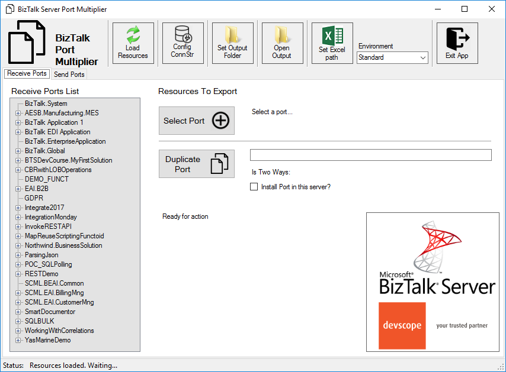

# BizTalk Port Multiplier Tool
Often times during development, and even in production, you have a need to create new BizTalk ports that are virtually identical to an existing one where we just need to change some small configurations or the URI. And basically the only options we have are:
* Export the application binding files, manually clean the file and change the values; And then import the Binding file again;
* Or manually reacreate the entire port again;
Bothe options are time consuming and need a lot of manually work.

“BizTalk Port Multiplier Tool” is a simple tool that aims to simplify this process by allowing you to easily "clone or duplicate" an existing port (Receive Port or Send Port).

**Note**: This is not a exact clone for the receive ports because they may have several Receive Locations and teh Address/URI needs to be unique. So, you then need to go to each receive location and reconfigure them.

This tool will extend default BizTalk Server capabilities transforming the tedious and sometimes complicate port creation based on an existing one a little simple and easy.

# Description
This tool allows you to create new ports on the BizTalk Server Administration Console with the following capabilities:
* Create a new Receive Port based on an existing one;
  * It will also export the binding file from that new Receive Port;
* Create a new Send Port based on an existing one;
  *  It will also export the binding file from that new Send Port;
* Generate different binding files for each environement

# About US
**Sandro Pereira** | [DevScope](http://www.devscope.net/) | MVP & MCTS BizTalk Server 2010 | [https://blog.sandro-pereira.com/](https://blog.sandro-pereira.com/) | [@sandro_asp](https://twitter.com/sandro_asp)

**Pedro Almeida** | [DevScope](http://www.devscope.net/) | Integration Developer 
